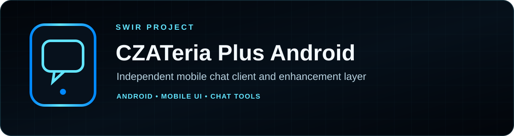
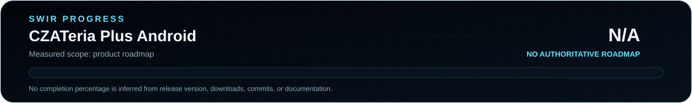

<!-- SWIR-README-STANDARD:v2 -->

 

 

 

[**Highlights**](#-highlights) · [**Install**](#-installation) · [**Status**](STATUS.md) · [**Releases**](#-releases)

CZATeria Plus Android is an **independent community Android project** built around a mobile-oriented CZATeria experience and selected XBookmark 9.9 Mobile features. It is **not an official Interia/CZATeria application**.

## 📍 Project Status

Product progress: **N/A** — the repository has no authoritative measurable product roadmap, so the release number and published APK are not converted into a completion percentage.

| Item | Status |
|---|---|
| Latest public release | **v0.6.3** |
| Platform | Android |
| Public artifact | `Czateria_PLUS_Android_v0.6.3.apk` |
| SHA-256 | `845c47a54a7eb8132d0df7818383b8d6fd93c38b5e34fbe119bbd72bcaa9f2a9` |
| Product progress source | [STATUS.md](STATUS.md) |

## 🚀 Overview

The current public release focuses on a phone-oriented interface and selected chat enhancements, including Friend Radar, colored writing/nick presentation, mention highlighting, GIF/code handling and a touch-scrollable top menu.

The current default branch contains **documentation and release metadata rather than the application source tree**, so this README intentionally does not publish guessed build-from-source instructions.

## ✨ Highlights

| Feature | What it does |
|---|---|
| 📱 Mobile UI | Phone-oriented interface and touch-friendly top navigation |
| 👥 Friend Radar | Provides the mobile friends/radar workflow described by the release |
| 🌈 Colored writing | Supports fixed, random and rainbow message-color modes through `msgColorId` |
| 🎨 Colored nick presentation | Keeps the mobile nick-color presentation |
| 🔔 Mentions | Highlights mentions and can play a notification sound |
| 🖼️ GIF / CZATeria codes | Supports GIF/code handling in the mobile experience |
| 🧹 Cleaner mobile shell | Removes desktop MOD/CHNS UI elements and the top advertising strip described by the release notes |
| ⚙️ Mobile settings | Uses a mobile settings flow rather than the desktop MOD panel |

## ⚙️ Installation

1. Open the verified **[v0.6.3 GitHub Release](https://github.com/Swir/Czateria_PLUS_Android/releases/tag/v0.6.3)**.
2. Download `Czateria_PLUS_Android_v0.6.3.apk`.
3. Verify the file if desired using the published SHA-256 above.
4. On Android, allow installation from the source you used to download the APK if the operating system prompts you.
5. Install the APK.

No source-build procedure is documented because the current default branch does not contain an Android project/source tree.

## 📋 Requirements / Compatibility

- Android device capable of installing the published APK.
- Permission to install an APK from the download source when required by Android.
- Network access is required for the underlying online chat service.
- No broader Android-version compatibility claim is made here because the repository does not currently expose a manifest/source tree that would support a more precise statement.

## 🎮 Usage / Workflow

After installation, use the mobile interface for the supported chat workflow. Friend Radar, message-color modes, nick colors, mention highlighting and GIF/code handling are the main user-facing additions described by the current release.

## 📦 Releases

Latest public release: **[CZATeria Plus Android v0.6.3](https://github.com/Swir/Czateria_PLUS_Android/releases/tag/v0.6.3)**.

The release contains the APK `Czateria_PLUS_Android_v0.6.3.apk`. Detailed release notes remain available in [`RELEASE_NOTES.md`](RELEASE_NOTES.md).

## ⚠️ Limitations / Responsible Use

- This is an independent community project and is not an official Interia/CZATeria application.
- The current repository does not contain the application source tree, so this README does not claim reproducible source builds or source-level compatibility verification.
- Service behavior can depend on the external CZATeria service and may change independently of this repository.
- The project should be used in accordance with the service's rules and applicable law.

## 🔎 Search Keywords

`CZATeria Android client` • `CZATeria mobile app` • `Android chat client` • `Friend Radar Android` • `mobile chat enhancements` • `colored chat messages Android` • `mention notifications chat` • `GIF chat Android` • `community Android chat client` • `XBookmark mobile features` • `Android APK chat` • `Polish chat Android`

### `CHAT • CUSTOMIZE • CONNECT`

⭐ **If this project is useful, consider leaving a star.**

[**← SWIR profile**](https://github.com/Swir) · [**All projects →**](https://github.com/Swir?tab=repositories)

